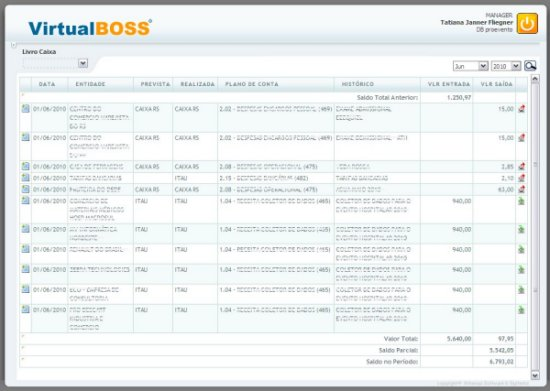

# VirtualBOSS

Old prod - This is project management control like "Jira", but with more features like financial control, invoices, survey control, employees, etc... and as well, have a project, activities, task and backlog manager.

<table width:100%>
  <tr>
    <td></td>
    <td></td>
    <td></td>
    <td></td>
  </tr>
  <tr>
    <td></td>
    <td></td>
    <td></td>
    <td></td>
  </tr>
</table>

# This README would normally document whatever steps are necessary to get the application up and running.

Things I may want to cover soon:

* (IIS) Internet Information Service Version

* System dependencies (ASP, PHP, MySQL5)

* Configuration

* Database creation / Database initialization

* ...

# To RUN

* ...
